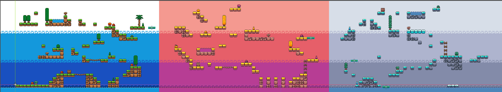

# Hack the Computer

## Creators
Product Owner: [@BKZeigler](https://github.com/BKZeigler)
 
Scrum Master: [@brian-250](https://github.com/brian-250)
 
Team Member: [@notlenzo](https://github.com/notlenzo)
 
Team Member: [@Rafaan-Hyder](https://github.com/Rafaan-Hyder)

## How to play?

<b>1.</b> Clone our repository
 
<b>2.</b> Click the play button
 
 
🎮Have fun!🎮

## My role — level design

*This is a fork of a team project. Notes below cover my own contributions.*

I was the level designer. I designed and built the game's level from initial layout through final tuning — platform placement, gap distances, hazard positioning, and enemy placement — and built the meshes and collision geometry for the platforms and objects across the map.

Most of the design work was tuning the layout against the character's movement. My teammates set the player's speed and jump height, so I tested every jump against those values and revised the geometry where a gap wasn't reliably clearable or where the spacing read as unfair. That loop — place, test, adjust — ran through most of development.

I designed three levels for the game; we only had time to implement one within the semester. All three are laid out contiguously in the project with traversal between them, since we hadn't settled on whether to use scene transitions or seamless movement, so I built them to work either way.

Built in Godot for CPSC 362 (Software Engineering) at CSU Fullerton, Spring 2025.
